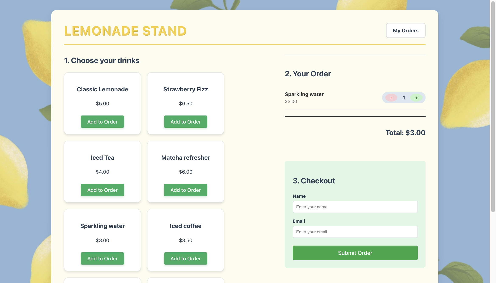
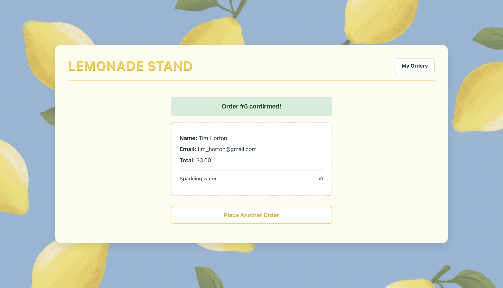
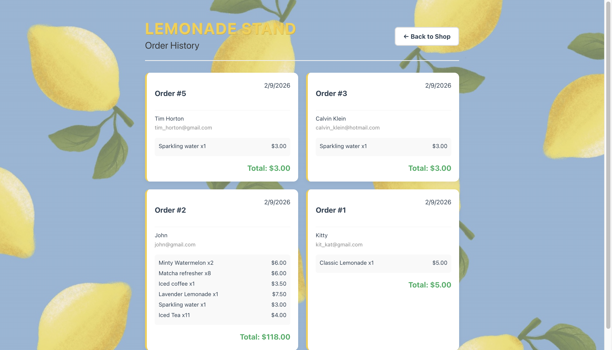

# 🍋 Lemonade Stand Full-Stack App

## 🚀 Live Demo

**Click here to view the live application:**

### [https://katerynavaizer.github.io/lemonade-stand/](https://katerynavaizer.github.io/lemonade-stand/)

_(Note: The backend is hosted on AWS App Runner. If the server has been idle, the first request might take a few seconds to wake up.)_

---

## 📖 Project Summary

This is a full-stack e-commerce application allowing users to view a menu of beverages, manage a shopping cart, and place orders. It features a persistent PostgreSQL database, order validation, and a responsive UI.

### ☁️ Architecture (Hybrid Cloud)

The application uses a **Cross-Region Hybrid Architecture** on AWS to optimize for cost and data residency constraints.

```ascii
+------------------+           HTTPS            +--------------------------+
|   User Browser   | -------------------------> |      GitHub Pages        |
|                  | <------------------------- | (Frontend Hosting)       |
+------------------+                            +--------------------------+
        |
        | API Requests (JSON)
        v
+------------------------------------------------------+
|            AWS Cloud (US East N. Virginia)           |
|                                                      |
|   +----------------------------------------------+   |     +------------------+
|   |             AWS App Runner                   | <-------|  GitHub Actions  |
|   | (Node.js Container - Auto Scaling Compute)   |   |     |  (CI/CD Pipeline)|
|   +----------------------------------------------+   |     +------------------+
+------------------------------------------------------+              |
        |                                                             | Push Image
        | Secure DB Connection                                        v
        |                                            +-----------------------------+
+---------------------------------------+            |      Amazon ECR             |
|       AWS Cloud (Canada Central)      |            | (Docker Image Registry)     |
|                                       |            +-----------------------------+
|   +-------------------------------+   |
|   |        Amazon RDS             |   |
|   | (PostgreSQL Database Engine)  |   |
|   +-------------------------------+   |
+---------------------------------------+

```

---

## 🛠 Technologies Used

### Frontend

- **React + Vite:** For fast, modern UI development.
- **React Router:** For client-side navigation between the Shop and Order History.
- **Axios:** For handling HTTP requests to the backend.
- **Zod:** For strict frontend form validation before data is sent.
- **CSS Modules:** For component-scoped styling.

### Backend

- **Node.js & Express:** REST API architecture.
- **PostgreSQL:** Relational database for storing beverages and order history.
- **Docker:** Containerization of the server for consistent deployment.

### DevOps & Infrastructure

- **GitHub Actions:** Automated pipelines for deploying the Client to GitHub Pages and the Server to AWS.
- **AWS App Runner:** Managed service for running the backend container.
- **Amazon ECR:** Storing Docker images.
- **Amazon RDS:** Managed PostgreSQL database.

---

## ⚙️ How to Run Locally

### Prerequisites

- Node.js (v20+)
- PostgreSQL installed locally (or access to a remote DB URI)

### 1. Database Setup

Create a local PostgreSQL database and run the schema found in `server/config/schema.sql`.

### 2. Server Setup

1. Navigate to the server directory:

```bash
cd server

```

2. Install dependencies:

```bash
npm install

```

3. Create a `.env` file in the `server` folder with your local DB credentials:

```env
DB_USER=postgres
DB_HOST=localhost
DB_NAME=lemonade_db
DB_PASSWORD=your_password
DB_PORT=5432
DB_SSL=false

```

4. Start the server:

```bash
node server.js

```

_(Server runs on port 8080)_

### 3. Client Setup

1. Open a new terminal and navigate to the client directory:

```bash
cd client

```

2. Install dependencies:

```bash
npm install

```

3. Start the development server:

```bash
npm run dev

```

4. Open the localhost URL provided by Vite (usually `http://localhost:5173`).

---

## 📋 Assumptions Made

1. **Currency:** All prices are in CAD/USD (generic dollar format).
2. **Stock:** The application assumes infinite stock for the "Lemonade Stand" concept; inventory management was not required for this scope.
3. **Authentication:** No user login is required; orders are tracked simply by email address for demonstration purposes.
4. **Deployment:** The database is public-accessible (with password protection) to allow the cross-region App Runner instance to connect without complex VPC peering costs.

---

## 📸 Screenshots

### Shop Menu & Cart



### Order Success & Receipt



### Order History


